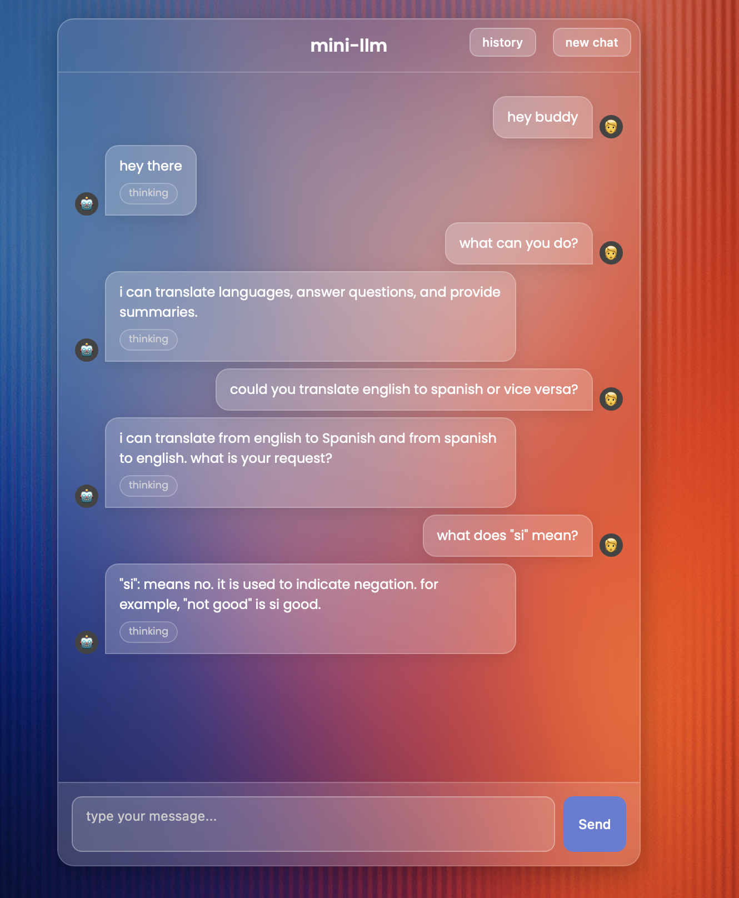

<p align="center">
  
</p>

# minillm — local llm + rag demo

this repo shows how to **train your own mini-llm**, add a **retrieval-augmented generation (rag) pipeline**, and serve a **pretrained hf model** with a simple web ui.  
tested on macbook pro m1. lightweight + educational.

---

## features
- **train from scratch** → tiny gpt-like model on your own dataset  
- **rag** → index + search docs with embeddings + faiss (vector search)  
- **pretrained model** → integrate huggingface models (`CraneAILabs/ganda-gemma-1b` by default)  
- **web ui** → minimal chat-like interface (`web/index.html`)  
- **fastapi server** → backend serving, easy to extend  

---

## repo structure
minillm/
├── src/ # training + serving code <br> </br>
│ ├── server_hf.py # fastapi server for pretrained model
│ ├── server.py # (optional) server for scratch-trained model
│ ├── train_minigpt.py # training loop for mini-llm
│ ├── sample_minillm.py
│ ├── model.py # gpt-like model definition
│ └── tools/ # helpers: tokenizer training, binify, corpus downloader
│
├── rag/ # retrieval-augmented generation pipeline
│ ├── ingest.py # chunk + embed documents
│ ├── build_index.py # build faiss/annoy index
│ ├── search.py # query top-k passages
│ └── index/ # generated vector indexes (ignored in git)
│
├── web/ # minimal html/js ui
│ └── index.html
│
├── tokenizer/ # optional tokenizer artifacts
│ ├── spm_bpe_16k.model
│ └── spm_bpe_16k.vocab
│
├── checkpoints/ # training checkpoints (ignored in git)
│ └── out-minillm/best.pt
│
├── pretrained/ # pointers for hf pretrained models
│ └── README_PRETRAINED.md
│
├── scripts/ # helpers for downloads + setup
│ └── download_weights.sh
│
├── README.md
├── README_RAG.md
├── requirements.txt
└── .gitignore


---

## 🚀 quickstart

### 1. setup environment
```bash
python3 -m venv ~/.venvs/minillm
source ~/.venvs/minillm/bin/activate
pip install -r requirements.txt
2. run the pretrained server

uvicorn src.server_hf:app --reload --port 8000
open browser → http://127.0.0.1:8000
you’ll see the chat ui running locally.

3. run rag indexing
see README_RAG.md for details.

4. train from scratch

python src/train_minigpt.py
checkpoints saved to checkpoints/out-minillm/.

handling large files
model checkpoints (.pt, .bin), rag indexes (.faiss, .pkl) → not committed (see .gitignore)

download them using scripts/download_weights.sh

pretrained model instructions in README_PRETRAINED.md


license & credits

training code → inspired by nanoGPT & HF examples
pretrained → CraneAILabs/ganda-gemma-1b
rag → faiss + sentence-transformers
ui → minimal html/css/js
licensed under mit. datasets/models used must follow their respective licenses.
